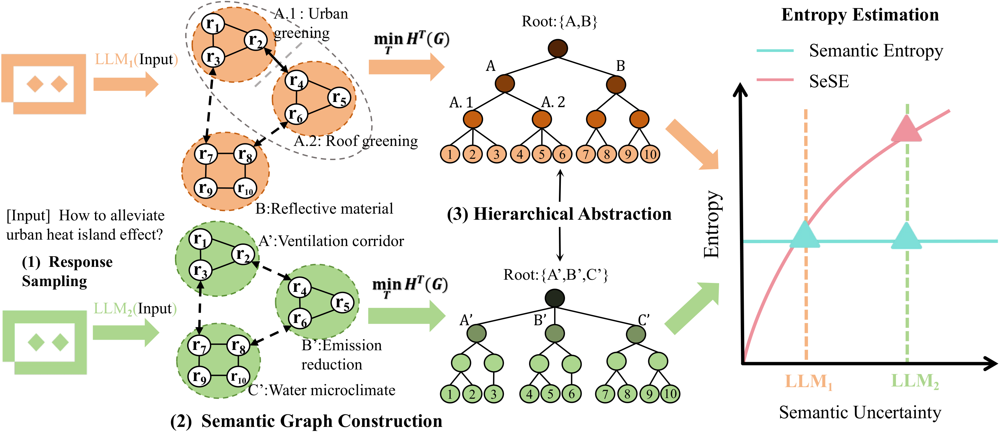

# **SeSE** &mdash; *Knowing What Large Language Models Don’t Know*

<div align="center">

[-gold)](https://openreview.net/forum?id=THZuVvy7SV)
[](https://www.python.org/)
[](https://pytorch.org/)

</div>

<div align="center">
    
  </a>
  <br />
</div>

---

> Our paper [《SeSE: Black-Box Uncertainty Quantification for Large Language Models Based on Structural Information Theory》](https://arxiv.org/abs/2511.16275) has been accepted by <strong>UAI 2026</strong> as an Oral presentation (top 1% of 1087 submissions).


## Introduction

Large language models (LLMs) are increasingly deployed in safety-critical scenarios, yet they remain prone to **hallucinations** -- generating plausible but factually incorrect responses. Reliable **uncertainty quantification (UQ)** is essential for enabling LLMs to abstain from answering when uncertain, thereby mitigating these risks. We propose **Semantic Structural Entropy (SeSE)**, a **principled black-box UQ framework** that works for both **open- and closed-source LLMs** without requiring access to internal model states.

### Key Contributions

- **Principled Information Theory-based Approach**: Unlike existing semantic UQ methods that overlook latent semantic structural information, SeSE reveals the intrinsic hierarchy of the LLM semantic space by constructing its optimal hierarchical abstraction based on the principle of structural entropy minimization. The structural entropy of this optimal abstraction quantifies the inherent uncertainty within the semantic space after optimal compression.

- **Theoretical Generalization**: We theoretically prove that SeSE generalizes Semantic Entropy (SE), the gold standard for UQ in LLMs -- SeSE recovers SE when the encoding tree is restricted to a single layer, demonstrating it as a strictly more expressive framework.

- **Granular Claim-level Uncertainty Estimation**: While existing methods focus primarily on simple short-form outputs, SeSE provides interpretable and granular claim-level uncertainty estimation for long-form generation. By constructing claim-response bipartite graphs and computing claim-level structural entropy, it captures fine-grained semantic dependencies between claims and responses.

- **State-of-the-Art Performance**: Extensive experiments across 24 model-dataset combinations demonstrate SeSE is superior performance over baselines.


---

## Project Overview

This code repository contains all the code necessary to reproduce the experiments in the paper. We have publicly released all the code and data used to generate the main experiment results.

The project consists of two main modules:
1. **Long-form uncertainty quantification** -- detects hallucinations and quantifies uncertainty in paragraph-level LLM outputs via claim-response bipartite graphs
2. **Short-form generation uncertainty quantification** -- quantifies semantic uncertainty in standard QA tasks (BioASQ, TriviaQA, SQuAD, etc.) via structural entropy

---

## Project Structure

```
README.md                      Project documentation
environment.yml                Conda dependencies
requirements.txt               Python dependencies
long_form_structural_entropy/  Module for long-form uncertainty quantification
  HCSE.py                      Implements Hierarchical Clustering Structural Entropy
  main.py                      Main entry script for long-form experiments
  utils.py                     Utility functions for evaluation
  run_record/                  Stores experimental outputs
sentence_structural_entropy/   Module for short-form uncertainty quantification
  analyze_results.py           Analyzes results and metrics
  sample_answers.py            Samples LLM-generated responses
  uncertainty_quantification.py    Implements uncertainty quantification
  src/                         Submodules for data processing, models, etc.
    data/                      Datasets
    models/                    Model configurations
    uncertainty_measures/      UQ method implementations
    utils/                     Utility functions
  run_record/                  Stores experimental outputs
```

---

## System Requirements

### Hardware Dependencies

Our experiments require modern computer hardware suited for working with large language models (LLMs).

- **CPU and RAM**: Intel 10th-generation CPU with 16 GB RAM or better.
- **GPU**: One or more NVIDIA GPUs are required for LLM inference.
  - **7B models**: NVIDIA GeForce RTX 4090 (24 GB) is sufficient.
  - **13B models**: NVIDIA A100 server GPU recommended.
  - **70B models**: Two NVIDIA A100 GPUs (2x80 GB) or eight RTX 4090 (8x24 GB).

### Software Dependencies

- **OS**: Ubuntu 20.04.6 LTS (GNU/Linux 5.15.0-89-generic x86_64)
- **Python**: 3.11
- **PyTorch**: 2.5.1

The file [environment.yml](environment.yml) lists the exact versions of all Python packages used in our experiments.

---

## Installation Guide

### Step 1: Install Conda

If you do not have conda installed, follow the instructions at [https://conda.io/](https://conda.io/).

### Step 2: Set Up Environment

```bash
conda-env update -f environment.yml
conda activate SeSE
```

The installation process is expected to take approximately **20 minutes**.

### Step 3: Set Environment Variables

- **Linux/macOS**:
  export HUGGING_FACE_HUB_TOKEN=<your_token>
  export OPENAI_API_KEY=<your_api_key>

- **Windows**:
  $env:HUGGING_FACE_HUB_TOKEN="<your_token>"
  $env:OPENAI_API_KEY="<your_api_key>"

**Note**: You may need to request access to the official Meta LLaMa model repository ([apply here](https://huggingface.co/meta-llama)). The sentence-level experiments use GPT-5-Mini (OpenAI API) for accuracy assessment, which incurs variable costs (typically ~$5/run).

Datasets are automatically downloaded via Hugging Face Datasets on first execution, except for **BioASQ** (task b, BioASQ11, 2023), which must be manually downloaded from [here](http://participants-area.bioasq.org/datasets) and placed at ./sentence_structural_entropy/src/data/bioasq/.

---

## Experimental Reproduction

### 1. Long-form Structural Entropy

Uncertainty quantification in long-form LLM-generated text.

```bash
python long_form_structural_entropy/main.py
```

**Key Files**:
- HCSE.py -- Implements Hierarchical Clustering Structural Entropy (HCSE) calculation
- main.py -- Main entry point (LLM calls, adjacency matrix construction, structural entropy calculation, and evaluation)
- utils.py -- Evaluation and utility functions

Results are saved in long_form_structural_entropy/run_record/.

### 2. Short-form Structural Entropy

Quantifies semantic uncertainty in short-form QA tasks.

```bash
# Step 1: Sample answers
python sentence_structural_entropy/sample_answers.py --model_name=$MODEL --dataset=$DATASET $EXTRA_CFG

# Step 2: Run uncertainty quantification
python sentence_structural_entropy/uncertainty_quantification.py --runid <run_id>

# Step 3: Analyze results
python sentence_structural_entropy/analyze_results.py --runid <run_id>
```

**Key Files**:
- sample_answers.py -- Samples answers from LLMs
- uncertainty_quantification.py -- Implements uncertainty quantification
- analyze_results.py -- Analyzes uncertainty metrics (e.g., AUROC, structural entropy)
- src/ -- Submodules for data processing, models, and utilities

For detailed parameter descriptions, refer to sentence_structural_entropy/src/utils/utils.py.

Results are saved in sentence_structural_entropy/run_record/.

---

## Run Records

The run_record/ folders in both modules store intermediate outputs (charts, metrics, etc.) for reproducibility and analysis.

---

## Citation

If you find this work useful in your research, please cite:

```bibtex
@inproceedings{
UAI2026sese,
title={Se{SE}: Black-Box Uncertainty Quantification for Large Language Models Based on Structural Information Theory},
author={Xingtao Zhao, Hao Peng, Dingli Su, Xianghua Zeng, Chunyang Liu, Jinzhi Liao, Philip S. Yu},
booktitle={Forty-Second Annual Conference on Uncertainty in Artificial Intelligence},
year={2026},
url={https://openreview.net/forum?id=THZuVvy7SV}
}
```

---

